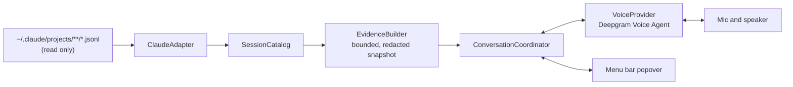

<p align="center">
  
</p>

<h1 align="center">Vayen</h1>

<p align="center">
  <em>Talk to your coding agents' sessions. Not to the agents. About them.</em>
</p>

<p align="center">
  <a href="#quick-start">Quick start</a> &middot;
  <a href="#how-it-works">How it works</a> &middot;
  <a href="#what-leaves-your-mac">What leaves your Mac</a> &middot;
  <a href="CONTRIBUTING.md">Contributing</a> &middot;
  <a href="https://github.com/apurv-1/vayen/discussions">Discussions</a>
</p>

<p align="center">
  <a href="https://github.com/apurv-1/vayen/actions/workflows/ci.yml"></a>
  <a href="LICENSE"></a>
  
  
</p>

---

> **Status: pre-release.**
> The core library and a command-line tool build and run against real Claude Code sessions today.
> The menu bar app and the live voice loop are under active development and are not yet usable.
> There is no signed build, no Homebrew tap, and no release yet.
> If you want to follow along, watch the repo or read the [architecture notes](docs/architecture.md).

## The problem

You kick off five coding agents on five issues, each in its own worktree.
Forty minutes later you come back and cannot remember what issue three was about, let alone what the agent did with it.
The transcript is thousands of lines.
So you copy it into a chat window and ask: what was this about, what did it change, why, and what should I look at carefully?

That works well.
The copying is the stupid part.

Vayen removes the copying.
It lives in your Mac menu bar, finds your local coding agent sessions on its own, and lets you ask about any one of them out loud.

```
┌─────────────────────────────────────────┐
│ Sessions                                │
│                                         │
│ ● Claude Code                           │
│   Fix tokenizer caching bug             │
│   ~/code/unsloth                        │
│   Active 40s ago                        │
│                              [Talk]     │
│                                         │
│ ● Claude Code                           │
│   Implement streaming benchmark         │
│   ~/code/llm-d                          │
│   Turn ended 4m ago                     │
│                              [Talk]     │
└─────────────────────────────────────────┘
```

You: "What is this one doing?"

Vayen: "The transcript starts with a request to fix a cache miss in the tokenizer when the vocab file changes.
The agent traced it to a stale hash in `TokenizerCache.swift`, changed the hash to include the file's modification time, and is now running the test suite.
The last test output I can see is from about a minute ago and had two failures."

You: "Why did it touch the hash instead of the loader?"

Vayen answers from the transcript.
If the transcript does not say, Vayen says so.

## What Vayen is, and is not

Vayen is a read-only observer.

- It reads the session files that Claude Code already writes to disk. It never writes to them.
- It never sends instructions to the coding agent. The agent keeps working on its own.
- It never claims a task is finished. It reports what the transcript shows and when the last record landed. Silence is not success.
- It never invents rationale. Answers are grounded in the recorded transcript, and the model is told to say when the evidence is missing.
- It is not a dashboard. No task creation, no orchestration, no Kanban, no analytics, no team sync.

The whole point is to answer three questions quickly: which agents do I have, what are they doing, and let me talk about one.

## Quick start

### Requirements

- macOS 15 or later on Apple Silicon
- Xcode 16 or later (for the Swift 6 toolchain)
- Claude Code installed, with at least one session under `~/.claude/projects`
- For voice: a [Deepgram](https://deepgram.com) API key. You supply your own key. Vayen has no server and no shared account.

### Build the command-line tool

The CLI is the fastest way to see what Vayen can read from your machine.
It never touches the network unless you ask it to talk.

```bash
git clone https://github.com/apurv-1/vayen.git
cd vayen/Packages/VayenCore
swift build -c release
```

List every Claude Code session Vayen can find, most recent first:

```bash
.build/release/vayen-cli discover
```

Follow a running session live, printing each new transcript record as Claude writes it:

```bash
.build/release/vayen-cli tail <session-id-prefix>
```

Print the exact evidence packet the model would receive for a question.
This is the best way to check that nothing you did not expect would leave your Mac:

```bash
.build/release/vayen-cli evidence <session-id-prefix> "what is it working on"
```

Have a text-mode conversation about a session.
Today this uses a mock voice provider that exercises the evidence tool path without calling any API:

```bash
.build/release/vayen-cli talk <session-id-prefix>
```

If Claude Code stores sessions somewhere other than `~/.claude/projects` (for example when `CLAUDE_CONFIG_DIR` is set), pass `--root /path/to/projects`.

### Run the menu bar app

Not yet.
The Xcode project in `Vayen.xcodeproj` is a placeholder while the core library settles.
This section will document `open Vayen.xcodeproj`, the microphone permission prompt, and Keychain setup for your Deepgram key once the app runs end to end.

## How it works



**Discovery.**
`ClaudeAdapter` walks `~/.claude/projects/<project>/<uuid>.jsonl` plus each session's `subagents/` transcripts.
It opens files read-only and tracks inode and size so a truncated or replaced file is re-parsed cleanly instead of producing garbage.

**Normalization.**
Every JSONL record becomes a `NormalizedEvent` with a stable `SourceReference` (file, generation, record index, block index).
User prompts, assistant text, tool calls, tool results, titles, and compaction markers are all typed.
Thinking blocks are recognized so they can be excluded from anything outbound.
Unknown record kinds are counted, not dropped silently.

**Evidence.**
When you ask a question, `EvidenceBuilder` assembles one immutable snapshot for that turn: the original request, the most recent relevant events within a token budget, a count of what was omitted, and the timestamp of the newest record it saw.
`Redactor` strips recognizable credential shapes (API keys, PEM blocks, JWTs, bearer tokens) before anything leaves the machine.
Each turn is bound to one snapshot version so a fast-moving session cannot mix two states inside one answer.

**Voice.**
`VoiceProvider` is a small protocol.
The first implementation speaks Deepgram's Voice Agent WebSocket protocol: your microphone audio goes up, speech comes back, and the model can call one client-side function, `get_selected_session_evidence`, which resolves locally against the session you selected.
The model cannot choose a different session, a file path, or a command.
The agent is instructed to explain neutrally in two or three sentences, attribute claims to the transcript, and say what is missing rather than guess.

**Lifecycle.**
Closing the popover stops capture and playback, cancels the turn, and disconnects.
Reopening starts idle with the microphone off.
There is no hidden call in the background.

## What leaves your Mac

Nothing, until you click Talk and start the microphone.

After that, and only for the session you selected:

| Data | Destination | Why |
| --- | --- | --- |
| Microphone audio | Deepgram | Speech to text |
| Redacted evidence snapshot for the selected session | Deepgram, then the model you configured in Deepgram | Grounded answers |
| Your question and the spoken reply | Deepgram | Conversation |

What never leaves:

- Other sessions, other projects, or anything under a different root
- Thinking blocks, signatures, or opaque reasoning material
- Your repository, git state, or any file the transcript merely mentions
- Raw audio recordings stored on disk (Vayen does not write them)
- Your API key, which lives in the macOS Keychain and is sent only as an auth header to Deepgram

Vayen has no telemetry and no server of its own.
Deepgram's retention and the retention of whichever model provider you select in Deepgram are governed by your own account settings with them.
Vayen does not claim zero retention on your behalf.

## Roadmap

In rough order.
Nothing here is a promise or a date.

1. Menu bar app running end to end against one live Claude Code session
2. Live Deepgram voice loop with barge-in and the evidence tool
3. Signed and notarized direct download, then a Homebrew cask
4. Codex CLI adapter
5. Cursor adapter
6. ElevenLabs as a second `VoiceProvider`

Adding a new harness should mean implementing `HarnessAdapter` and nothing else.
If it turns out to mean more, that is a bug in the boundary and worth an issue.

## Repository structure

```
Packages/VayenCore/         Swift package. All logic lives here and is testable without the app.
  Sources/VayenCore/
    Contracts.swift         Shared types: SessionIdentity, NormalizedEvent, EvidenceSnapshot, ...
    HarnessAdapter.swift    The boundary every coding agent integration implements
    Claude/                 Claude Code adapter, JSONL record model, normalizer, tailer
    Catalog/                Session list, load, poll, snapshot versioning
    Evidence/               Snapshot builder and secret redaction
    Conversation/           Coordinator binding one session to one voice conversation
    Voice/                  VoiceProvider protocol, Deepgram implementation, mock
    Settings/               Keychain and non-secret preferences
  Sources/vayen-cli/        Command-line tool: discover, tail, evidence, talk
  Tests/VayenCoreTests/     Fixture-based tests (synthetic transcripts only)
Vayen/                      SwiftUI menu bar app (placeholder today)
Vayen.xcodeproj             Xcode project for signing, entitlements, resources
docs/                       Architecture and design notes
```

## Contributing

Issues and pull requests are welcome.
Read [CONTRIBUTING.md](CONTRIBUTING.md) for setup, the test policy on transcript fixtures, and how the read-only rule is enforced in review.
Security reports go through [GitHub private vulnerability reporting](https://github.com/apurv-1/vayen/security/advisories/new); see [SECURITY.md](SECURITY.md).

This project follows the [Contributor Covenant](CODE_OF_CONDUCT.md).

## License

Apache License 2.0.
See [LICENSE](LICENSE) and [NOTICE](NOTICE).
