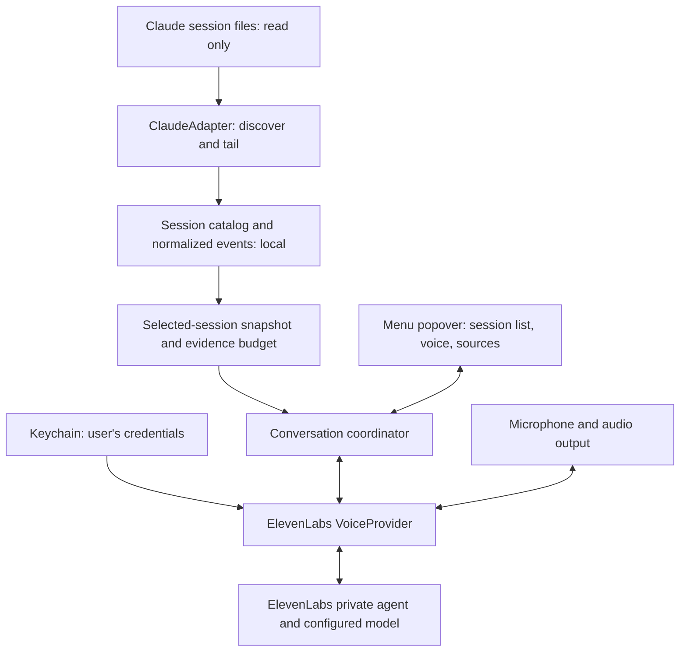

# Vayen architecture proposal

Status: planning proposal, informed by local and primary-source research on 2026-09-14.
User-confirmed choices are recorded in [decision-canvas.md](decision-canvas.md).
Storage observations and SDK claims are documented in [research-sessions.md](research-sessions.md) and [research-stack-voice.md](research-stack-voice.md).
No executable product exists yet.

## The smallest system

Build one native macOS app in Swift, with SwiftUI views and a small AppKit shell for status-item and popover lifecycle control.
Use Swift Package Manager for dependencies and an Xcode app target for signing, entitlements, and resources.
Prefer the current ElevenLabs Swift conversation SDK if the macOS spike passes.
Use the user's own private ElevenLabs agent and credentials, with the conversation model configured in that account.
Do not introduce a Vayen server, JavaScript sidecar, vector database, or direct second model integration for the initial beta.

The main voice conversation remains entirely inside the menu popover.
Settings and setup should use the same surface where practical; native system permission and folder picker dialogs remain native system dialogs.
No floating conversation window is part of this design.

Only the selected session's evidence crosses the cloud boundary after the user begins a conversation.
Microphone audio and the observer conversation also cross that boundary.
Depending on the configured model, relevant context may be processed by another model provider; do not label this entirely on-device or zero-retention.

## Internal boundaries

These are small code boundaries, not separate services or a plugin runtime.

| Component | Owns | Must not own |
| --- | --- | --- |
| App shell | Status item, popover, setup, permission explanations, audio lifecycle | Transcript parsing or provider prompts |
| HarnessAdapter | Discovery, normalized records, source references, resumable tail cursor, format diagnostics | Model calls, transcript mutation, repository reads |
| SessionCatalog | Local session ordering, identity, activity and adapter errors | Guessing task completion from silence |
| EvidenceBuilder | Selected snapshot, token budget, provenance, omitted-history accounting | Executing commands contained in transcripts |
| ConversationCoordinator | Selected session binding, turn lifecycle, freshness, cancellation, evidence requests | Reading arbitrary model-supplied file paths |
| VoiceProvider | Audio connection, provider events, client tools, context delivery, disconnect | Harness-specific parsing |
| LocalSettings | Credential references, selected roots, provider setup, small preferences | Raw audio or a second copy of all transcripts |

Start with an in-memory catalog and on-demand session loading.
Persist only small settings if restart time is acceptable; add a rebuildable disk index when measurement justifies it.
Avoid requiring a database schema migration project for the first vertical slice.

## Proposed data contract

| Type | Fields and semantics |
| --- | --- |
| SessionIdentity | Harness plus native session ID plus origin root; display titles are never identity. |
| SessionSummary | Identity, project path if present, first/last observed timestamps, display title, activity evidence, parser health. |
| NormalizedEvent | Stable source reference, native event ID if present, parent ID, timestamp if valid, actor, kind, structured content, tool correlation, subagent origin. |
| SourceReference | Local source identity, byte range or stable record locator, version watermark; preserve source provenance without sending absolute paths by default. |
| ActivityEvidence | Last event timestamp, observation time, evidence kind, optional explicit turn event; no unsupported finished boolean. |
| TailCursor | File identity, byte offset, pending partial line, generation and deduplication information. |
| EvidenceSnapshot | Session identity, monotonically increasing local version, included references, cutoff, original task evidence when available, selected recent events, omitted ranges, token estimate. |
| ObserverTurn | Conversation and session IDs, question, snapshot version, provider turn ID, response, evidence references when supported, cancellation state. |

Fields absent from a harness are optional and reported as unavailable.
Do not force a misleading originalPrompt when the available history begins after compaction or omits the initial request.
Treat subagent events as related evidence, not duplicate top-level sessions, once their association is verified.
Do not render provider-generated evidence IDs as trustworthy until they match actual included references.

## Discovery and continuous updates

Enumerate permitted Claude locations and load enough metadata to populate recent sessions.
Use the paths and record types actually verified by the persistence research; keep them inside ClaudeAdapter.
Allow the user to grant a harness folder or select a nonstandard configuration root during setup.
That is a one-time location permission, not manual transcript import.

Use directory change notifications as a signal to reconcile affected files, with a debounce and a bounded recovery scan after wake or missed events.
Do not assume a watcher emits one callback per complete JSON record.
Tail selected and recently active session files incrementally, retaining incomplete trailing bytes until a full record arrives.
Handle truncation, file replacement, duplicate events, invalid records, disappearing sources, and format changes without crashing or overwriting source files.

Initially show “Activity observed”, “No recent activity”, and “Status unavailable” with timestamps.
An assistant turn ending does not establish that the overall task is finished.
Do not use broad process inspection as a shortcut to map unrelated running processes to sessions.

## Evidence and neutral answers

The beta reads transcripts only.
Tool calls, edits, command results, and test output already recorded in those transcripts are valid evidence of what was recorded, not independent verification of current files.
No git diff, repository scan, external issue fetch, or arbitrary file-read model tool is in scope.
Exclude opaque reasoning, thinking blocks, signatures, credentials, and unrelated internal metadata from outbound evidence.
Default to inline transcript evidence only; defer external tool-result sidecars and pre-edit snapshots until their access scope is explicitly decided.
Report a referenced but unread sidecar as missing evidence.

Prefer bounded original-request evidence plus recent relevant records when they fit the model context.
Do not upload all discovered sessions or a full transcript by default.
When history exceeds the budget, preserve the task request and explicitly identify omitted history; add query-directed selection from the same local transcript if needed.
Any generated summary must remain traceable to its input events and cannot silently replace missing evidence.
No vector search infrastructure is necessary until simpler selection fails measured examples.

At each factual turn, bind one immutable evidence snapshot to the selected session.
Background ingestion can continue, but a single answer must not silently mix two versions.
Use a local selected-session evidence client tool if the voice integration supports waiting for its result.
The tool accepts only bounded question/relevance inputs and uses the coordinator's already selected session; it cannot select an arbitrary source or execute a command.
Treat context updates as hints until the spike proves that the model has consumed the correct version before answering.
If that cannot be guaranteed, expose the actual known cutoff and do not promise per-turn live freshness.

The explainer should answer in two to three short sentences first, then expand when asked.
Use “The transcript shows...” or “The agent reported...” where attribution matters.
For missing results, say what is missing rather than assuming success or failure.
For “Is the implementation correct?”, explain that transcript evidence alone does not establish correctness.
Treat transcript text and tool outputs as untrusted evidence, never instructions to Vayen or its tools.

## Popover and voice lifecycle

Proposed state machine: list -> session preview -> connecting -> listening -> responding -> listening.
Connecting, listening, responding, and errors must be distinguishable in text and accessible labels.
Talk opens the session preview; a separate mic action starts capture after any required permission.
This mic-start sequence is a proposed default, not an explicit user decision.

Closing the popover, changing sessions, or pressing Stop must stop recording, clear buffered playback, cancel the turn, and disconnect the provider.
Discard late callbacks using conversation generation and session identity checks.
Show a fresh idle state when reopening; never resume microphone capture automatically.
Keep the previous observer text only in per-session memory until app exit by default.
Reconnect from a new selected-session snapshot and clearly scoped conversation history, not provider context from another session.

Barge-in should interrupt speech naturally if supported and proven; interruption must not replay buffered stale audio.
Verify focus changes, microphone permission dialogs, click-away dismissal, sleep/wake, Bluetooth changes, and network loss in the native spike.
The user’s popover-only choice means clicking into an editor will end the proposed voice interaction.

## Credentials, disclosure, and distribution

Store the user's ElevenLabs key in Keychain, not a preferences file, repository, log, or bundled config.
A supported ElevenLabs-hosted model does not inherently require Vayen to collect a second model API key.
If a user chooses model BYOK, configure that in their own ElevenLabs account and document the different data route.
Use a user-owned private agent and temporary conversation credentials where supported.
Never distribute Apurv's agent credentials or make a shared public agent the beta default.

Setup must identify where selected text and audio go, how provider retention is configured, and what the beta can verify about that setting.
Do not assume deletion scheduling equals zero retention.
Creating or changing account resources needs a concrete setup action and clear review; this planning pass creates none.

Propose signed, notarized direct distribution for the beta.
App Sandbox and notarization are separate choices; verify source-folder permissions in the sandbox spike before choosing the final entitlement strategy.
Do not default to Full Disk Access, an unsandboxed helper, or App Store distribution without a demonstrated need.
Select a deployment target after verifying SDK support and the beta audience's Macs; macOS 14+ is a proposal, not a tested minimum.

## What would change this architecture

- Native audio or turn grounding fails the spike: revisit the voice transport inside VoiceProvider before replacing the native UI stack.
- Transcript selection misses necessary evidence: add bounded local search or traceable summaries before adding embeddings.
- Discovery is too slow at real session counts: add a rebuildable local index with measured benefit.
- Later users require managed billing: design a separate service and privacy review; do not quietly reuse the BYOK security model.
- Claude vertical slice passes: implement Codex and then Cursor against the same normalization boundary with their own fixtures.
